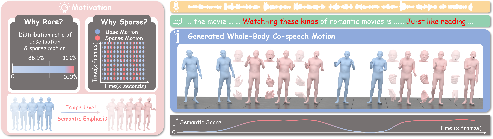

<div align="center">
<h2><font> </font></center> <br> <center>SemTalk: Holistic Co-speech Motion Generation with Frame-level Semantic Emphasis</h2>

[Xiangyue Zhang\*](https://xiangyue-zhang.github.io/), [Jianfang Li\*](https://github.com/Xiangyue-Zhang/SemTalk), [Jiaxu Zhang](https://kebii.github.io/), [Ziqiang Dang](https://github.com/Xiangyue-Zhang/SemTalk), [Jianqiang Ren](https://github.com/JianqiangRen), [Liefeng Bo](https://scholar.google.com/citations?user=FJwtMf0AAAAJ&hl=en), [Zhigang Tu†](http://tuzhigang.cn/)

<p align="center">
  <strong>✨ICCV 2025✨</strong>
</p>

<a href='https://arxiv.org/abs/2412.16563'></a> <a href='https://xiangyue-zhang.github.io/SemTalk/'></a>

<br>

</div>

# 📣 Updates

- **[2025.09.11]** 🔥 Release: - [✔] Inference code - [✔] Training code
- 
# 💖 Inference Data

If you would like to compare your paper’s results with SemTalk but find it too difficult to run the repository, you can simply download the test `.npz` file from [Google Drive](https://drive.google.com/file/d/1hm812R7QOIoLK9mxbDIKqNGF8xEuRzf9/view?usp=sharing).

# ⚒️ Quick Start

## Build Environtment

We Recommend a python version `=3.8` and cuda version `>=12.1`. Then build environment as follows:

```shell
# [Optional] Create a virtual env
conda create -n SemTalk python=3.8
conda activate SemTalk
# pytorch, torchvison
conda install pytorch==2.1.0 torchvision==0.16.0 torchaudio==2.1.0 pytorch-cuda=12.1 -c pytorch -c nvidia
# Install with pip:
pip install -r requirements.txt
pip install -U whisperx
sudo apt-get update && sudo apt-get install -y ffmpeg  # if you don't have ffmpeg
```

## Download Data

please refer to [EMAGE](https://github.com/PantoMatrix/PantoMatrix/tree/main) and download datasets from [BEAT2](https://huggingface.co/datasets/H-Liu1997/BEAT2) for datasets and place the dataset inside the SemTalk folder, i.e. `path-to-SemTalk/BEAT2`

## Download Weights

Download [hubert-large-ls960-ft](https://huggingface.co/facebook/hubert-large-ls960-ft)(used for extracting audio features), [faster-whisper-large-v3](https://huggingface.co/Systran/faster-whisper-large-v3)(used for inference) weights and place itside in the SemTalk folder, i.e. `path-to-SemTalk/facebook`.
If you are in China, you can use hf-mirror for faster and more reliable downloads. The process may take some time, so please be patient.

```
pip install -U huggingface_hub
export HF_ENDPOINT=https://hf-mirror.com
huggingface-cli download --resume-download facebook/hubert-large-ls960-ft --local-dir facebook/hubert-large-ls960-ft

huggingface-cli download --resume-download Systran/faster-whisper-large-v3 --local-dir Systran/faster-whisper-large-v3
```

Download [pretrained models and weights](https://drive.google.com/file/d/1U69gev4Ezvk7ArM986w0zAWE_QF-Pggw/view?usp=sharing) from google drive, unzip and place it in the SemTalk folder, i.e. `path-to-SemTalk/weights`.

Finally, these SemTalk folder should be orgnized as follows:

```text
.
├── BEAT2
│   └── beat_english_v2.0.0
├── configs
├── dataloaders
├── datasets   (this folder will appear after you generate the datasets)
│   ├── beat2_cache2
│   ├── beat2_semtalk_train
│   └── semtalk_dataloader.py
├── facebook
│   └── hubert-large-ls960-ft
├── models
├── optimizers
├── src
├── Systran
│   └── faster-whisper-large-v3
├── utils
├── weights
│   ├── pretrained_vq
│   ├── smplx_models
│   ├── best_semtalk_base.bin
│   └── best_semtalk_sparse.bin
├── ae_trainer.py
├── aelower_trainer.py
├── aelowerfoot_trainer.py
├── requirements.txt
├── semtalk_base_trainer.py
├── semtalk_sparse_trainer.py
└── train.py

```

## Generate Dataset

**Notice**: Please make sure you are in the root directory, i.e. `path-to-SemTalk`.

1. To generate the training dataset, run:

```shell
python dataloaders/save_train_dataset.py # generate train dataset
```

This process may take some time, so please be patient.

2. To generate the test dataset, run:

```shell
python dataloaders/save_test_dataset.py # generate test dataset
```

# 🚀Training, Testing, and Inference

## Training of SemTalk

### Train RVQ-VAE

You can either train your own RVQ-VAE weights and place them under `path-to-SemTalk/weights` using the commands below, or simply use our [pretrained weights](https://drive.google.com/file/d/1U69gev4Ezvk7ArM986w0zAWE_QF-Pggw/view?usp=sharing).

```shell
python train.py --train_rvq --config configs/cnn_vqvae_face_30.yaml # face
```

```shell
python train.py --train_rvq --config configs/cnn_vqvae_hands_30.yaml # hands
```

```shell
python train.py --train_rvq --config configs/cnn_vqvae_upper_30.yaml # upper body
```

```shell
python train.py --train_rvq --config configs/cnn_vqvae_lower_foot_30.yaml # lower foot
```

```shell
python train.py --train_rvq --config configs/cnn_vqvae_lower_30.yaml # lower body
```

### Stage1: Base Motion Generation

```shell
python train.py --config configs/semtalk_base.yaml
```

**Notice**: Once you have obtained the optimal base motion generation weights, please update the path field to `base_ckpt` in `configs/semtalk_sparse.yaml`.

###

### Stage2: Sparse Motion Generation

```shell
python train.py --config configs/semtalk_sparse.yaml
```

## Testing of SemTalk

**Notice**: Before running the test code, make sure the `load_ckpt` and `base_ckpt` paths in `configs/semtalk_sparse.yaml` are set correctly.

```shell
python train.py --test_state --config configs/semtalk_sparse.yaml
```

## Inference

you can put your inference wav format aduio on `./demo` path, for example, you can run:

```shell
python train.py --inference --config configs/semtalk_sparse.yaml --audio_infer_path ./demo/2_scott_0_1_1.wav
```

# 📺 Visualize

Following [EMAGE](https://github.com/PantoMatrix/PantoMatrix), you can download [SMPLX blender addon](https://huggingface.co/datasets/H-Liu1997/BEAT2_Tools/blob/main/smplx_blender_addon_20230921.zip), and install it in your blender 3.x or 4.x. Click the button Add Animation to visualize the generated smplx file (like xxx.npz).

# 🙏 Acknowledgments

Thanks to [EMAGE](https://github.com/PantoMatrix/PantoMatrix/tree/main/scripts/EMAGE_2024), [DiffSHEG](https://github.com/JeremyCJM/DiffSHEG), our code is partially borrowing from them. Please check these useful repos.

# 📖 Citation

If you find our code or paper helps, please consider citing:

```bibtex
@inproceedings{zhang2025semtalk,
  title={SemTalk: Holistic Co-speech Motion Generation with Frame-level Semantic Emphasis},
  author={Zhang, Xiangyue and Li, Jianfang and Zhang, Jiaxu and Dang, Ziqiang and Ren, Jianqiang and Bo, Liefeng and Tu, Zhigang},
  booktitle={Proceedings of the IEEE/CVF International Conference on Computer Vision},
  pages={13761--13771},
  year={2025}
}
```
